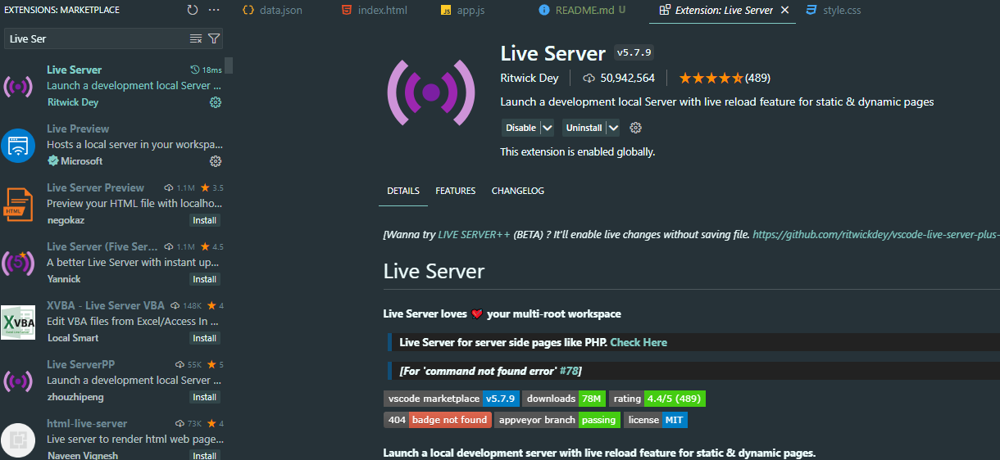

# JSON HTML CSS

## Installation

Clone the repository:

```sh
git clone https://github.com/alonzojoe/json-html-css
```

```sh
//locate the project
cd json-html-css
```

RUN using VSCode Live Server



Must have Live Server Extension in VSCode to avoid CORS error in data.json
